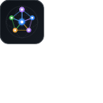

# CodeAtlas for VS Code & Cursor

<p align="center">
  
</p>

<p align="center">
  <strong>Local Codebase Intelligence: Hybrid Code Search, Knowledge Graph, Change Impact Analysis, and CodeLens Caller Metrics.</strong>
</p>

<p align="center">
  <a href="https://github.com/adityaiitg/codeatlas-rs">Rust Engine</a> •
  <a href="https://github.com/adityaiitg/codeatlas">Python Engine</a> •
  <a href="https://github.com/adityaiitg/codeatlas/blob/main/LICENSE">MIT License</a>
</p>

---

## ⚡ Overview

**CodeAtlas** brings native AI code intelligence directly into Visual Studio Code and Cursor. Powered by the ultra-fast CodeAtlas CLI engine (written in Rust & Python), it turns any repository into an indexed knowledge graph with sub-millisecond search and deep blast-radius analysis.

### Key Capabilities

- 🔍 **Hybrid Code Search View**: BM25 lexical ranking + Model2Vec/transformer dense vector embeddings + 1-hop graph neighborhood expansion with clickable code snippet previews.
- 💥 **Blast Radius & Caller Impact Tree**: Instant reverse-BFS dependency traversal showing all callers, functions, and modules affected if a symbol changes.
- 🗺️ **Interactive Knowledge Graph Webview**: Force-directed D3.js visualization of classes, functions, calls, and imports right inside your editor, with click-to-code navigation.
- 👁️ **CodeLens Caller Count Annotations**: Displays live `$(references) N callers • M blast radius` badges directly above function and class definitions across Python, TypeScript, JavaScript, Rust, and Go.
- ⏱️ **Auto-Indexing on Save**: Silently and incrementally keeps your workspace index fresh whenever files are modified.
- 🪝 **Git Background Hooks**: Seamless background re-indexing on git commits and branch checkouts.
- 📊 **Status Bar Integration**: Quick-action menu accessible in one click from the editor footer.

---

## 🚀 Installation & Prerequisites

CodeAtlas VS Code extension requires the `codeatlas` CLI binary installed on your system.

### Option A: Ultra-Fast Rust Engine (Recommended)
```bash
cargo install codeatlas
```

### Option B: Python Engine
```bash
pip install codeatlas
```

Verify installation:
```bash
codeatlas --version
```

---

## 💡 How to Use

### 1. Activity Bar Sidebar
Click the **CodeAtlas** icon in the VS Code Activity Bar (left sidebar):
- **Hybrid Code Search**: Type natural language or code symbols (e.g. `JWT token verification` or `Model2VecInner`).
- **Blast Radius & Callers**: Inspect direct dependents and full downstream ripple effects.
- **Workspace Overview**: View total files, symbols, graph edges, and database size.

### 2. CodeLens Caller Counts
Open any Python, TypeScript, JavaScript, Rust, or Go file. CodeAtlas will annotate definitions:
```typescript
// $(references) 4 callers • 11 blast radius
export class AuthenticationService { ... }
```
Clicking the CodeLens opens the blast-radius impact tree for that symbol.

### 3. Editor Context Menu
Right-click on any function, class, or text selection in the editor:
- **CodeAtlas: Find All Callers / Blast Radius for Symbol**
- **CodeAtlas: Search Codebase**

### 4. Interactive Knowledge Graph Viewer
Run `CodeAtlas: Open Interactive Knowledge Graph` from the Command Palette (`Cmd+Shift+P` / `Ctrl+Shift+P`) or click the graph icon in the sidebar:
- Zoom and pan through the codebase graph.
- Filter nodes by symbol or module name.
- Click any node to open the exact file and line in your editor.
- Click **Blast Radius** to calculate downstream impact.

---

## ⚙️ Extension Settings

| Setting | Type | Default | Description |
| :--- | :--- | :--- | :--- |
| `codeatlas.executable` | `string` | `"codeatlas"` | Path to the CLI binary. Can be an absolute path or `uvx codeatlas-cli`. |
| `codeatlas.embedder` | `string` | `"model2vec"` | Embedding approach: `'model2vec'` (fast pure-Rust) or `'ort'` (ONNX Runtime transformer). |
| `codeatlas.autoIndex` | `boolean` | `true` | Automatically re-index incrementally in the background when files are saved. |
| `codeatlas.codelensEnabled` | `boolean` | `true` | Display caller count annotations above function and class declarations. |
| `codeatlas.statusBarEnabled` | `boolean` | `true` | Show CodeAtlas indicator in the editor status bar. |
| `codeatlas.searchLimit` | `number` | `10` | Maximum number of hybrid search results to retrieve. |

---

## 📦 Building from Source & Packaging (.vsix)

```bash
git clone https://github.com/adityaiitg/codeatlas-vscode.git
cd codeatlas-vscode
npm install
npm run compile
npm run package
```
This produces `codeatlas-0.1.0.vsix`, which can be installed in VS Code via:
```bash
code --install-extension codeatlas-0.1.0.vsix
```

---

## 📄 License

MIT © [Aditya Pratap Singh](https://github.com/adityaiitg)
